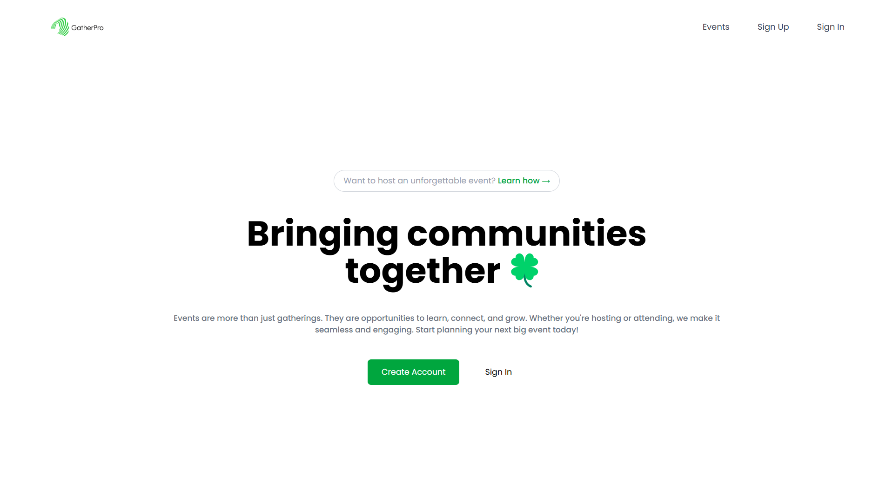
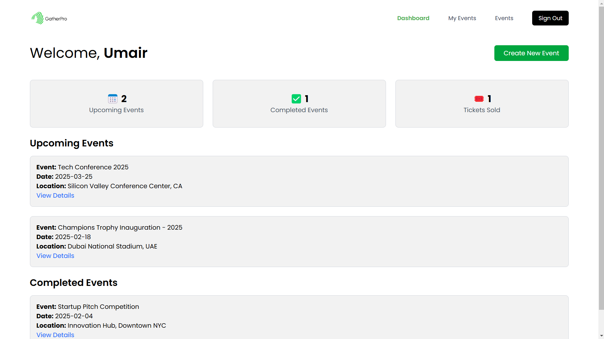
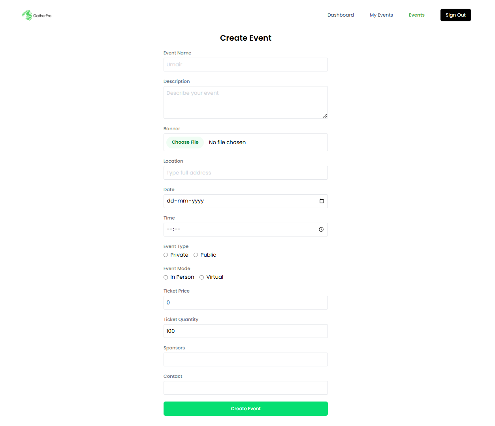

# Event Management Platform

## Overview

This project is an Event Management Platform designed to help users create, manage, and attend events seamlessly.

---

## Technologies Used

- **Frontend:**

  - React
  - Tailwind CSS

- **Backend:**

  - Node.js
  - Express.js

- **Database:**

  - MongoDB

- **Authentication & Authorization:**
  - JWT

---

## Features

- User authentication and authorization
- Event creation and management
- RSVP functionality
- Event search and filtering

---

## Screenshots



---


---



---


---



---

## Installation

1. Clone the repository:
   ```bash
   git clone https://github.com/yourusername/event_management_platform.git
   ```
2. Navigate to the project directory:
   ```bash
   cd event_management_platform
   ```
3. Install dependencies:
   ```bash
   npm install
   ```

---

## Usage

1. Register or log in to your account.
2. Create, manage, and attend events.

---

## License

This project is licensed under the MIT License.

---

## Contact

For any questions or feedback, please contact [your email].
